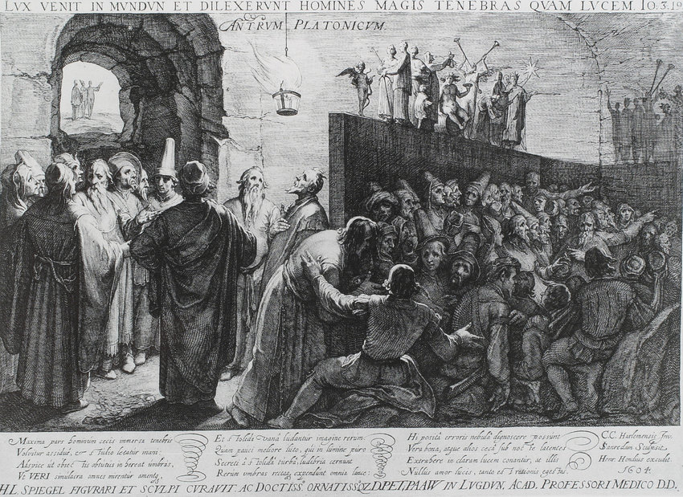
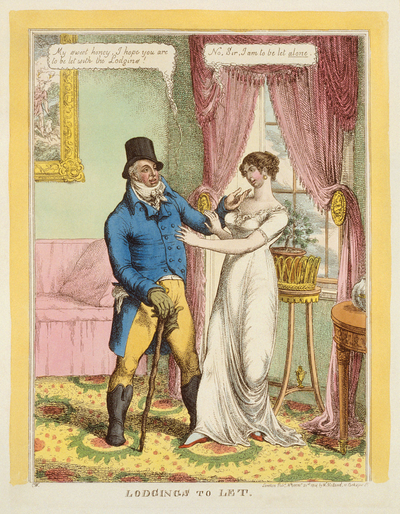

# Allegories

The cave of Plato. **The allegory of the cave** [[1]](https://en.wikipedia.org/wiki/Allegory_of_the_cave). All the aristocratic society is based on this **myth** [[2]](https://en.wikipedia.org/wiki/Myth). 

The neural control facility is the middle ages in our society, is the noble network. Here nobles of low level by the way observed and command by the highest level in this hierarchic do them dirty traffic:

- drug market.
- black market.
- human trafficking.
- child trafficking.
- weapon trafficking.
- organ trafficking.
- war planning.
- corruption.
- **influence peddling** [[3]](https://en.wikipedia.org/wiki/Influence_peddling).
- forced prostitution.
- forced labor.
- playing humans as game cards.
- etcetera etcetera.

Remember that allegories are presented in all the classics, and religions. In Catholicism they are the daily bread, *give us this day our daily bread* [[4]](https://en.wikipedia.org/wiki/Lord%27s_Prayer).  

### General operation of the noble network

**Double entendre** [[5]](https://en.wikipedia.org/wiki/Double_entendre). To give double meaning to something is obviously used to hide something that is horrible or illegal. Who use double meanings is a criminal or a victim of a corrupted system. Full stop. Nobility only use double entendre.

What I've learned listening to nobles here in network?

- That middle age still exist in radio. And this is the first of all.
- What pass in radio is still reflected in a controlled way physically. Radio is exaggerated.
- That almost all the people that I've known in my life are victim of nobility. Someone is an executioner.
- That when someone say to you to shut up, you have to speak.

Who are the victim of nobility? Normally nobles that are not recognized. What does it mean? Victims of child trafficking. Probably like me. Slaves, but I'm not.

Double entendre is applied human relation by nobles and by slaves with suggestions from the noble network, like in theater is the figure of the **prompter** [[6]](https://en.wikipedia.org/wiki/Prompter_(theatre)). 

In radio, because I call it radio, when you speak with a noble you have to apply to **rhetoric** [[7]](https://en.wikipedia.org/wiki/Rhetoric) of the **figure of speech** [[8]](https://en.wikipedia.org/wiki/Figure_of_speech) at every situation you have to applied the classical **rhetorical operations** [[9]](https://en.wikipedia.org/wiki/Rhetorical_operations):

- addition
- omission
- permutation
- transposition

Be extremely careful to not going crazy! In normal environment in conversations between human beings if someone use this type of rhetoric nowadays take the name of stalker. Nothing more, nothing less. Only stalking that is a crime.

### External links

1. https://en.wikipedia.org/wiki/Allegory_of_the_cave
2. https://en.wikipedia.org/wiki/Myth
3. https://en.wikipedia.org/wiki/Influence_peddling
4. [https://en.wikipedia.org/wiki/Lord%27s_Prayer](https://en.wikipedia.org/wiki/Lord's_Prayer)
5. https://en.wikipedia.org/wiki/Double_entendre
6. https://en.wikipedia.org/wiki/Prompter_(theatre)
7. https://en.wikipedia.org/wiki/Rhetoric
8. https://en.wikipedia.org/wiki/Figure_of_speech
9. https://en.wikipedia.org/wiki/Rhetorical_operations