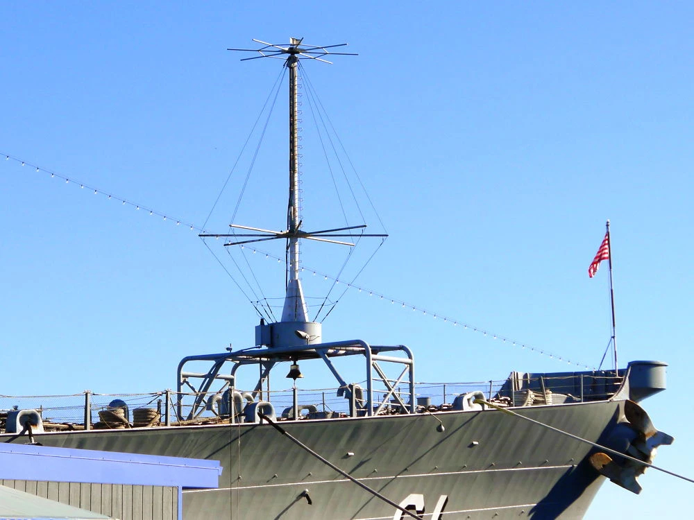
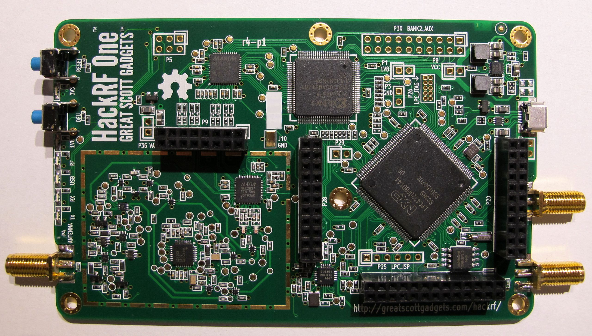

# RNMnetwork detecion

From **How to Make a Directed Energy Weapon Detection System for Less Than $50** [[1]](https://www.instructables.com/id/How-to-Make-a-Directed-Energy-Weapon-Detection-Sys):

> *The human body or any living system organs, tissues, cells and molecules can be hacked into based on predictable, calculated and experimentally adjusted known resonance frequencies based on fundamental nuclear, electronic, magnetic, rotational and vibrational states moments and transitions energies and frequencies. Thus, many medical conditions can be improved without the need for medications other than for limiting nutrients intake. Conversely, many if not all medical conditions can be created from **remote sensing** [[2]](https://en.wikipedia.org/wiki/Remote_sensing) and transmission stations directed energy weapons operations.*

I want to build a system to detect transmissions and signals from the remote neural monitoring network, a scanner based on software defined radios. 

First of we've to consider that the services are various, so there can be also various point of transmission and also it's possible that some are not terrestrial radio wave, but from the sky. So those are our point of interest:

- Neural control network from the church is using **Schumann resonances** [[3]](https://en.wikipedia.org/wiki/Schumann_resonances) as layer of conduction. So we've to build a special ELF parabolic dish pointing to the Earth electromagnetic field.
- Neural control network from the state is using LTE towers so we've to point to the nearest one with a dish or something directional.
- Voice to skull subliminal messages from the state is using mast antennas so we've to find the nearest one and build a ML antenna, I say build because there is no in the market.
- "Illuminati" game network is using terrestrial towers like the ones that I describe before so we've got to find the nearest one. 

If we cannot find the nearest transmission towers we've got to use a technique called **direction finding** [[4]](https://en.wikipedia.org/wiki/Direction_finding) or use a omnidirectional antenna that could operate in a wide rage, this is without any doubt a type of antenna called **discone antenna** [[5]](https://en.wikipedia.org/wiki/Discone_antenna).

Next that we've build a scanner and obtained the modulation and information included in the signal received we can try to build a transmission station, but this could be very difficult to obtain.

My physical position is **41.26667 , 1.76667** [[6]](https://goo.gl/maps/HjF6v9vgvKa4GEHe8).

### SDR based scanner

What we've got to build is an array of different type of antennas depending on the frequency, two software defined radio of medium quality to scan the spectrum, an antenna splitter, various antenna tuner possibly automated with a IoT, and a computer with a good ham radio linux distribution.

### External Links

1. https://www.instructables.com/id/How-to-Make-a-Directed-Energy-Weapon-Detection-Sys
2. https://en.wikipedia.org/wiki/Remote_sensing
3. https://en.wikipedia.org/wiki/Schumann_resonances
4. https://en.wikipedia.org/wiki/Direction_finding
5. https://en.wikipedia.org/wiki/Discone_antenna
6. https://goo.gl/maps/HjF6v9vgvKa4GEHe8