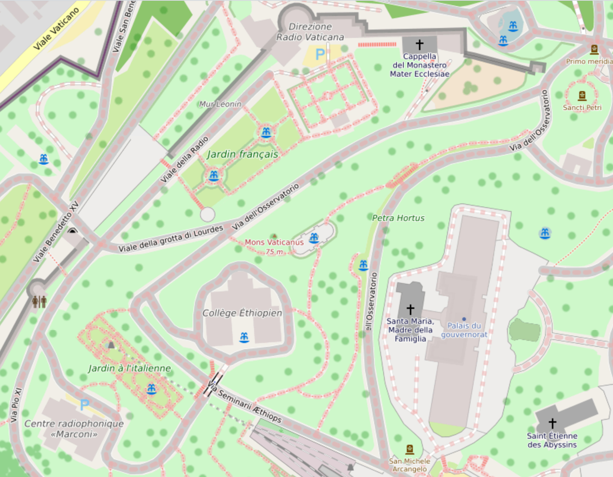

# Catholic church

This is a zoom on the left side street map of the Vatican city. There are some point of interest speaking about radio in the meaning of this technology is very important for the catholic church as we have speak about in some chapter before:

- **Marconi radio center** [[1]](https://www.wikiwand.com/it/Radio_Vaticana), the Vatican headquarters of the homonymous radio.
- A street that remember the **Pope Pio XI** [[2]](https://www.wikiwand.com/it/Papa_Pio_XI), because he inaugurated the radio in 1931 with **Guglielmo Marconi** [[3]](https://www.wikiwand.com/it/Guglielmo_Marconi). This Pope was very connected to Fascism and Nazism. The radio was assigned to the **Jesuits** [[4]](https://www.wikiwand.com/it/Compagnia_di_Ges%C3%B9) in a second time. Jesuits have contributed to the study of magnetism.
- Under the avenue Radio you can appreciate a garden named "français", the owner of the remote neural monitoring network has got root in France.
- On the right under a tower of the old walls you can appreciate the central the head office of the Vatican radio.

What I want to underline to you, reader? Simply, Vatican city is full of radio technology. But those are as usual my two cents.

### Christian name

### Name day

### External links

1. https://www.wikiwand.com/it/Radio_Vaticana
2. https://www.wikiwand.com/it/Papa_Pio_XI
3. https://www.wikiwand.com/it/Guglielmo_Marconi
4. [https://www.wikiwand.com/it/Compagnia_di_Ges%C3%B9](https://www.wikiwand.com/it/Compagnia_di_Gesù)