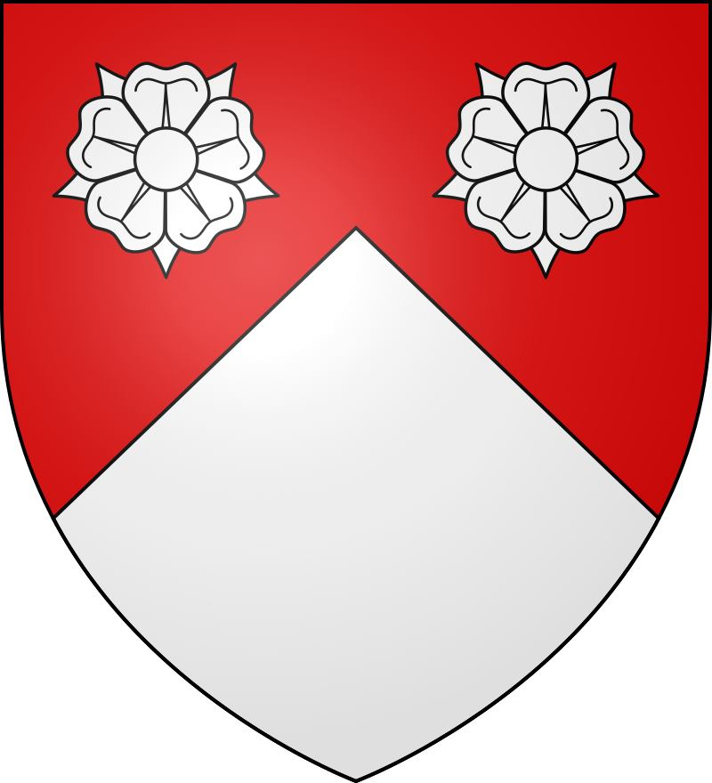
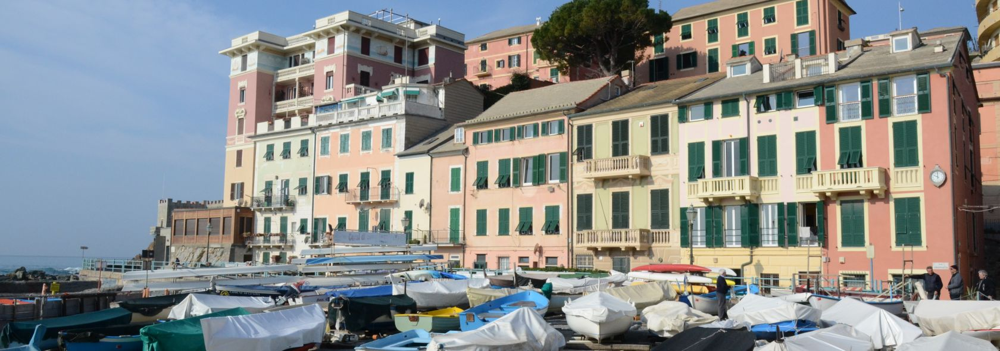

# Noble houses 

> *The word marquess entered the English language from the Frenche marchis ("ruler of a border area") in the late 13th or early 14th century. The French word was derived from marche ("frontier"), itself descended from the Middle Latin marca ("frontier"), from which the modern English words march and mark also descend. The distinction between governors of frontier territories and interior territories was made as early as the founding of the Roman empire when some provinces were set aside for administration by the senate and more unpacified or vulnerable provinces were administered by the emperor. The titles duke and count were similarly distinguished as ranks in the late empire, with dux (literally, "leader") being used for a provincial military governor and the rank of comes (literally "companion," that is, of the Emperor) given to the leader of an active army along the frontier.*

### Durand de la Penne

This is the **escutcheon** [[1]](https://en.wikipedia.org/wiki/Escutcheon_(heraldry)) of the **marquis** [[2]](https://en.wikipedia.org/wiki/Marquess) **Luigi Felice Giuseppe Mario Durand de la Penne** [[3]](https://it.wikipedia.org/wiki/Luigi_Durand_de_la_Penne_(1838)), he was a **general officer** [[4]](https://en.wikipedia.org/wiki/General_officer) in the **Kingdom of Sardinia** [[5]](https://en.wikipedia.org/wiki/Kingdom_of_Sardinia) and also senator of the **senate of Kindom of Italy** [[6]](https://en.wikipedia.org/wiki/Senate_of_the_Kingdom_of_Italy).

This territory in the south of France pertain to the departments of **Alpes-de-Haute-Provence** [[7]](https://en.wikipedia.org/wiki/Alpes-de-Haute-Provence) and **Alpes-Maritimes** [[8]](https://en.wikipedia.org/wiki/Alpes-Maritimes). This last **departments of France** [[9]](https://en.wikipedia.org/wiki/Departments_of_France) is surrounding the **Principality of Monaco** [[10]](https://en.wikipedia.org/wiki/Monaco). But also there's a town near that is called Orange, like the ISP.

https://notes9.senato.it/Web/senregno.NSF/d7aba38662bfb3b8c125785e003c4334/591cf55a86f14ba84125646f005b643e?OpenDocument

In this tab you can appreciate that his address was **via Astalli 15, Rome** [[11]](https://goo.gl/maps/ZR3Ef6kUws5RFgVT9). In this street we've got some point of interest:

- **Society of Jesus** [[12]](https://en.wikipedia.org/wiki/Society_of_Jesus)
- **Weapon of genius** [[13]](https://it.wikipedia.org/wiki/Comando_genio), a very important Italian military division.

Senator Durand de la Penne in an index from "discussions of the senate of the kingdom" from 22 of February  of 1902 to 6 of July of 1904, second session, speak about an high-power **radio-telegraph station** [[14]](https://en.wikipedia.org/wiki/Wireless_telegraphy), **Marconi** [[15]](https://en.wikipedia.org/wiki/Guglielmo_Marconi) system, approved by law of 5 April 1903 in the discussion of the balance of **post and telegraphs** [[16]](https://en.wikipedia.org/wiki/Poste_italiane).

Guglielmo Marconi was an Italian radio pioneer and an **electrical engineer** [[17]](https://en.wikipedia.org/wiki/Electrical_engineering), and my father is also.

One of the child of Senator Durand de la Penne was **Luigi Durand de la Penne** [[18]](https://en.wikipedia.org/wiki/Luigi_Durand_de_la_Penne) born in Genoa on 11 of February 1914 and die on 17 of January 1992. Considered an Italian military hero but in reality *a fascist* belongs to the deadly **Decima Flottiglia MAS** [[19]](https://en.wikipedia.org/wiki/Decima_Flottiglia_MAS).

He is important in the military history because of being a **frogman** [[20]](https://en.wikipedia.org/wiki/Frogman) in the second world war. 

> *The name **frog** [[21]](https://en.wikipedia.org/wiki/Frog), that is an animal, remember me also the swimming style **breaststroke** [[22]](https://en.wikipedia.org/wiki/Breaststroke) that is the only style that swim my mother in open sea, salt water. A frog croak and it could be written as crack. **Crack** [[23]](https://en.wikipedia.org/wiki/Crack_cocaine) is a dope. To crack in computer science is break security with **brute force** [[24]](https://en.wikipedia.org/wiki/Brute-force_attack). In the organization chart of the "Illuminati" facility the frog is the animal that represent who call wife the Catalan head, the butcher. She has destroyed the life of who I was calling brother with exactly this drug, crack. In subliminal message service my mother and the wife of the butcher say that "play" together I think that this could mean that she is the B-side of my mother. She acts like a fascist and my mother is totally church related. But as usual those are only my two cents.* 

Luigi was a **Lieutenant** [[25]](https://en.wikipedia.org/wiki/Lieutenant_(navy)) in the **Italian Navy** [[26]](https://en.wikipedia.org/wiki/Italian_Navy), abbreviated as "MM", *man in the middle or machine but always my two cents*, when on 19 of December 1941 carried out **a raid on Alexandria** [[27]](https://en.wikipedia.org/wiki/Raid_on_Alexandria_(1941)), Egypt, using **manned torpedoes** [[28]](https://en.wikipedia.org/wiki/Human_torpedo), called Maiali that is the animal pig but that can also mean sexual violence, sexual harassment, prostitution. Remember the number 9 always present, masonry, military, nobles, church. Always the same. Was Italy versus Great Britain. Luigi was considered an hero for a great shark attack, under water. The perimeter of the marquisate of this noble family determinate a **shark tooth** [[29]](https://en.wikipedia.org/wiki/Shark_tooth), symbol of **Georgia** [[30]](https://en.wikipedia.org/wiki/Georgia_(country)), a nation with an alphabet composed by hearts (საქართველოს რესპუბლიკა). The perimeter could be interpreted also like an **arrowhead** [[31]](https://en.wikipedia.org/wiki/Arrowhead). The arrowhead is present in the **sagittarius constellation** [[32]](https://en.wikipedia.org/wiki/Sagittarius_(constellation)), Saray is born under the sagittarius. **Gamma2** [[33]](https://en.wikipedia.org/wiki/Gamma2_Sagittarii) in a star in the arrowhead.

> *What does it mean under a noble point of view? Simple this house work with Doe like girls, women who make men fall in love with the ultimate goal of making them lose their mind. To make them lose their business. And with the ultimate goal of ending up in a remote betting system that has as its purpose or well suicide or well the reduction to a small drug dealer of a man, to make him a slave of the Mafia which in turn they use to subjugate the subject. Remember that also Mafia soldiers are utilized by those big noble houses. But this are my two cents nothing more nothing less dear Francesca.*

Luigi got a son his name was Renzo, my father call him a "*very good man*". I don't know, I've seen him one time in them house in a **crêuza** [[34]](https://it.wikipedia.org/wiki/Cr%C3%AAuza) in the department of Vernazzola an ancient fishing port. Houses pastel harmful colors. Ligurian style.

 So we've got understand how the Durand family in the course of a middle century change their physical position from France east territory to the old **Genoese maritime republic** [[35]](https://en.wikipedia.org/wiki/Republic_of_Genoa), a site full of history and nobles family. They are conquerors.

### External links

1. https://en.wikipedia.org/wiki/Escutcheon_(heraldry)
2. https://en.wikipedia.org/wiki/Marquess
3. https://it.wikipedia.org/wiki/Luigi_Durand_de_la_Penne_(1838)
4. https://en.wikipedia.org/wiki/General_officer
5. https://en.wikipedia.org/wiki/Kingdom_of_Sardinia
6. https://en.wikipedia.org/wiki/Senate_of_the_Kingdom_of_Italy
7. https://en.wikipedia.org/wiki/Alpes-de-Haute-Provence
8. https://en.wikipedia.org/wiki/Alpes-Maritimes
9. https://en.wikipedia.org/wiki/Departments_of_France
10. https://en.wikipedia.org/wiki/Monaco
11. https://goo.gl/maps/ZR3Ef6kUws5RFgVT9
12. https://en.wikipedia.org/wiki/Society_of_Jesus
13. https://it.wikipedia.org/wiki/Comando_genio
14. https://en.wikipedia.org/wiki/Wireless_telegraphy
15. https://en.wikipedia.org/wiki/Guglielmo_Marconi
16. https://en.wikipedia.org/wiki/Poste_italiane
17. https://en.wikipedia.org/wiki/Electrical_engineering
18. https://en.wikipedia.org/wiki/Luigi_Durand_de_la_Penne
19. https://en.wikipedia.org/wiki/Decima_Flottiglia_MAS
20. https://en.wikipedia.org/wiki/Frogman
21. https://en.wikipedia.org/wiki/Frog
22. https://en.wikipedia.org/wiki/Breaststroke
23. https://en.wikipedia.org/wiki/Crack_cocaine
24. https://en.wikipedia.org/wiki/Brute-force_attack
25. https://en.wikipedia.org/wiki/Lieutenant_(navy)
26. https://en.wikipedia.org/wiki/Italian_Navy
27. https://en.wikipedia.org/wiki/Raid_on_Alexandria_(1941)
28. https://en.wikipedia.org/wiki/Human_torpedo
29. https://en.wikipedia.org/wiki/Shark_tooth
30. https://en.wikipedia.org/wiki/Georgia_(country)
31. https://en.wikipedia.org/wiki/Arrowhead
32. https://en.wikipedia.org/wiki/Sagittarius_(constellation)
33. https://en.wikipedia.org/wiki/Gamma2_Sagittarii
34. [https://it.wikipedia.org/wiki/Cr%C3%AAuza](https://it.wikipedia.org/wiki/Crêuza)
35. https://en.wikipedia.org/wiki/Republic_of_Genoa

