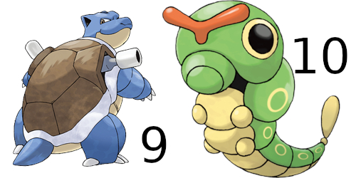
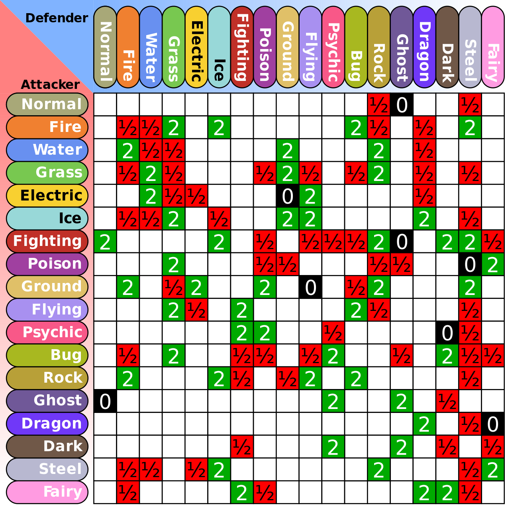
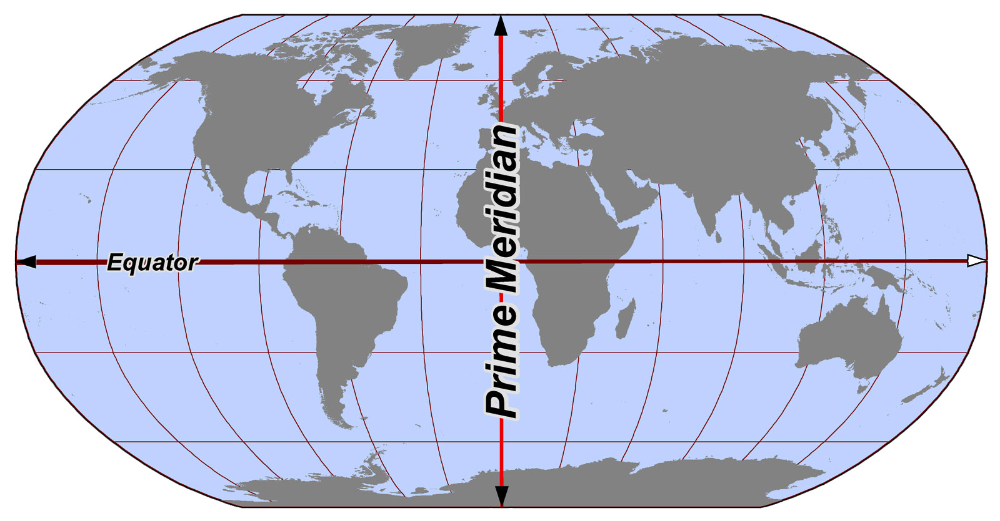

# Machines identification numbers 

### The Italian state

*"All roads lead to Rome"*, a medieval **proverb** [[1]](https://en.wikipedia.org/wiki/Proverb). 

*This is only my two cents, don't go crazy dear fellows.* 

The telephonic prefix of Rome's province is 6. In the *world backwards*, that is how they explain meanings in subliminal voice service in the remote neural monitoring network, 6 is 9. In binary 6 is 00000110 and in the *world backwards* that is in my opinion the logical operator "not" is 11111001 that in decimal is 249 and in hexadecimal is F9. 

Speaking about the telephone prefix, 9 is south Italy, **Sicily** [[2]](https://en.wikipedia.org/wiki/Sicily), **Calabria** [[3]](https://en.wikipedia.org/wiki/Calabria), some province of **Campagna** [[4]](https://en.wikipedia.org/wiki/Campagna) and a province of **Puglia** [[5]](https://en.wikipedia.org/wiki/Apulia). Color is hexadecimal is #fdde9d and in **common name** [[6]](http://chir.ag/projects/name-that-color) is **Cherokee** [[7]](https://en.wikipedia.org/wiki/Cherokee).

As you can see telephone prefix 6 is the province of Rome. Vatican city add after the 06 code another three digit, 698. 

Another good correspondence could be the **ISO 3166** [[8]](https://en.wikipedia.org/wiki/ISO_3166) followed by **ISO 3166-2** [[9]](https://en.wikipedia.org/wiki/ISO_3166-2) and the consequent **ISO 3166-2:IT** [[10]](https://en.wikipedia.org/wiki/ISO_3166-2:IT), those are the codes of interest speaking about the number 9:

- IT-72 Campania, 01001000, 10110111, 183
- IT-78 Calabria
- IT-75 Puglia
- IT-82 Sicilia

Remember a think, in the world backwards or better saying the remote neural control network what address humans, but also system it's possible with a correct access point connected to them with a bridge, are unique electromagnetic identification. It's possible that those decimal numbers obtained by the not logic operation are possibly paid with this reasoning. 

Now another brainstorm have conducted me to think that the number 9 it's only to confuse me and put me in a theme of Mafia threats. 

I was born in Genova, prefix code 010, area code 01, color green reef #daffb4. And I've got parent from area code **1, 4, 7, 5**. Here is a little family tree:

https://www.myheritage.es/member-998780751_1/riccardo-beniamino-giuntoli?public=1

But I've got also parents from New York, Florida and Ireland. 

I'm not a noble and i'm not a masonic nor I've got some Lions or Rotary affiliations.

> *Now those machines are connected to the remote neural control network, but could also be connected by Internet or by a private metropolitan area network or could be connected by analogical telephone cable and could be reached by a remote PPP call with a modem. And many others technologies.* 

Another brainstorm have conducted me to think about bank accounts. It could be possible that at every machine there's a bank account situated in one of the six European fiscal heavens:

- **Andorra** [[11]](https://en.wikipedia.org/wiki/Andorra)
- **San Marino** [[12]](https://en.wikipedia.org/wiki/San_Marino)
- **Luxembourg** [[13]](https://en.wikipedia.org/wiki/Luxembourg)
- **Liechtenstein** [[14]](https://en.wikipedia.org/wiki/Liechtenstein)
- **Monaco** [[15]](https://en.wikipedia.org/wiki/Monaco)
- **Switzerland** [[16]](https://en.wikipedia.org/wiki/Switzerland)

All of those banks are obviously connected to the **institute for the work of religion** [[17]](https://en.wikipedia.org/wiki/Institute_for_the_Works_of_Religion), the **Vatican city** [[18]](https://en.wikipedia.org/wiki/Vatican_City) bank. 

But remember that those are only my to cents because we can try to debug also the **international bank account number** [[19]](https://en.wikipedia.org/wiki/International_Bank_Account_Number). 

### Pokemon correlation: a noble game.

Remember that machines are shared between target individuals sure? Ok this seams to be a stupidity but in the "Illuminati" game, that in reality is a digital pseudo dictatorship that is changing our Europe and the world, machine numbers are represented by **Pokemon** [[20]](https://en.wikipedia.org/wiki/Pok%C3%A9mon) identifications.

From this stupidity I know for sure that I'm in neural control from 1999. At the age of eighteen, only my parents could have authorize this crime destroying my privacy from twenty one years. The first **role-playing video game** [[21]](https://en.wikipedia.org/wiki/Role-playing_video_game) was developed by **Game Freak** [[22]](https://en.wikipedia.org/wiki/Game_Freak) and published by **Nintendo** [[23]](https://en.wikipedia.org/wiki/Nintendo), that is for sure related with the remote neural monitoring network as you can appreciate for the number of target individuals in Japan. One important association is **"technological crime victims network nonprofit organization"** [[24]](http://tcvn.sakura.ne.jp/).

Also colors are important means groups, but remember that basic colors are utilized in gang stalking to do brain washing. To confuse minds. In reality peoples that have access to this network for me are also targets individuals. In this network people are considered like machines, but one time that you're in the only think that have importance is money. But works related to this shit are all frauds. This is a pyramid. It's a fraud. All correlated with black market, prostitution, sexual harassment. All the people here inside gain money on whatever you do one time you're in. This is a fraud. But in reality this game is orchestrated by the elite like we've analyze, nobles, state and church. In reality is utilized to do mass social influencing, destroy democracy and rebuild fascism. It's a scandal nothing more. All the economy inside this system is crypt concurrency related, what does it mean? That is a very big fraud also to the state. We've to stop immediately this system and the method to use is exactly how they catch Al Capone, **tax fraud** [[25]](https://en.wikipedia.org/wiki/Tax_evasion). 

For example machine number 9, the number they say that belongs to me in this game that is a fraud, in reality I think that machine are not frauds but yes they exist and I've got four machines from the Italian government (1, 2, 4 and 5) indicate color blue, like my eyes, and type water that in Spanish could mean police (**¡agua!** [[26]](https://blogs.20minutos.es/yaestaellistoquetodolosabe/de-donde-proviene-gritar-agua-para-avisar-de-la-presencia-de-la-policia/)). This could mean that in this fraud I've got to denunciate all, and actually I'm doing it so it is not all totally false. A classic noble game.

Speaking about colors and seeing the table of the first **151 Pokemon** [[27]](https://en.wikipedia.org/wiki/List_of_generation_I_Pok%C3%A9mon) (more one because it has **no number** [[28]](https://en.wikipedia.org/wiki/MissingNo.) and this I like very much because is the result of a **glitch** [[29]](https://en.wikipedia.org/wiki/Glitch)) we can derive those codes of colors:

1. #2dcd45 **emerald** [[30]](https://en.wikipedia.org/wiki/Emerald) game machine numbers 1,2,3,43,44,45,46,47,69,70,71,114
2. #883688 **plum** [[31]](https://en.wikipedia.org/wiki/Plum) game machine numbers  1,2,3,13,14,15,23,24,29,30,31,32,33,34,41,42,43,44,45,48,49,69,70,71,72,73,88,89,92,93,94,109,110,
3. #f08030 **jaffa** [[32]](https://en.wikipedia.org/wiki/Jaffa) game machine numbers 4,5,6,37.38,58,59,77,78,126,146
4. #a890f0 **portage** [[33]](https://en.wikipedia.org/wiki/Portage) game machine numbers 6,12,16,17,18,21,22,41,42,83,84,85,123,130,142,145,146,149
5. #149eff **dodger blue** [[34]](https://en.wikipedia.org/wiki/Dodger_blue) game machine numbers 7,8,9,54,55,60,61,62,72,73,79,80,86,87,90,91,98,99,116,117,118,119,120,121,129,130,131,134,138,139,140,141
6. #a8b820 **citron** [[35]](https://en.wikipedia.org/wiki/Citron)
7. #a8a878 **hillary** [[36]](https://en.wikipedia.org/wiki/Edmund_Hillary)
8. #f8d030 **saffron** [[37]](https://en.wikipedia.org/wiki/Saffron_(color))
9. #e0c068 **equator** [[38]](https://en.wikipedia.org/wiki/Equator)
10. #ee99ac **wewak** [[39]](https://en.wikipedia.org/wiki/Wewak)
11. #ff6996 **hot pink** [[40]](http://veli.ee/colorpedia/?c=ff6996)
12. #98d8d8 **aqua island** [[41]](http://veli.ee/colorpedia/?c=98d8d8)
13. #b8a038 **roti** [[42]](http://veli.ee/colorpedia/?c=b8a038)
14. #700aee **electric violet** [[43]](http://veli.ee/colorpedia/?c=700aee)
15. #94352d **stiletto** [[44]](http://veli.ee/colorpedia/?c=94352d)

As you can see I've used some links to Wikipedia and others to a site where you can appreciate similar colors, a briefing about the significance and others colors that goes well with.

### The catholic church machine levels

This patchwork of images are copied from the film **Fantozzi** [[45]](https://en.wikipedia.org/wiki/Fantozzi_(film)) based on the novel from **Paolo Villaggio** [[46]](https://en.wikipedia.org/wiki/Paolo_Villaggio).

Fantozzi, the main character is a pro-communist trade unionist employee of a mega enterprise. At the end of the film he take the facility elevator and at the 19 floor he's got an hallucination, better saying someone stream to his visual and auditory system a scene, and see him crucified in the mess hall. Next he arrives to the 28 floor indicated by the elevator with a star. In an ambient very similar to the paradise all done with light and with some church furniture the director take Fantozzi to his chair and say to him to just sit down. They start a discussion where the director say to him that we're all the same but he use different words to explain the same. It's only about words and phrases. Obviously he use his ignorance and he drunks him with his manner to speak.  

Fantozzi  begins to turn to him with different titles being obviously excited and insecure to speak to him directly due always to his ignorance. Reference to the church are obvious. The director say to him before start to speak if he want some water, not wine or better saying not blood so it's not a ceremony, and some bread. This is the sequence of titles that he starts to use:

1. **Count** [[47]](https://en.wikipedia.org/wiki/Count)
2. **Sir** [[48]](https://en.wikipedia.org/wiki/Sir)
3. **Majesty** [[49]](https://en.wikipedia.org/wiki/Majesty)

Next they discuss a little bit about communism and then the director say to the employer to go out from his chair and say to him to sit down where you **genuflect** [[50]](https://en.wikipedia.org/wiki/Genuflection) in church. Next the titles pass from the nobility to the church in this order:

1. **Sacred** [[51]](https://en.wikipedia.org/wiki/Sacred)

Next Fantozzi got some visions obviously Machine related. And when he see him colleagues an aquarium speak about the "usher Tritti drawn" the director put him in the same aquarium. What is the allegory? Simple he shutdown the active state of the machine. But he call him for the last time:

1. **Almighty** [[52]](https://en.wikipedia.org/wiki/El_Shaddai)

But almighty it's not about God, that yes you know man he doesn't exist in reality ou... sure it is!, it's about the **Judaism** [[53]](https://en.wikipedia.org/wiki/Judaism). 

This is the end? No...I don't think so.

> *So what is this Machine? It's something international and world and space based used by who command. Divided in levels starting from the nobles to the really unknown. With this machine they observe and change the fate of the world, including affect nature.* 

### External links

1. https://en.wikipedia.org/wiki/Proverb

2. https://en.wikipedia.org/wiki/Sicily

3. https://en.wikipedia.org/wiki/Calabria

4. https://en.wikipedia.org/wiki/Campagna

5. https://en.wikipedia.org/wiki/Apulia

6. http://chir.ag/projects/name-that-color

7. https://en.wikipedia.org/wiki/Cherokee

8. https://en.wikipedia.org/wiki/ISO_3166

9. https://en.wikipedia.org/wiki/ISO_3166-2

10. https://en.wikipedia.org/wiki/ISO_3166-2:IT

11. https://en.wikipedia.org/wiki/Andorra

12. https://en.wikipedia.org/wiki/San_Marino

13. https://en.wikipedia.org/wiki/Luxembourg

14. https://en.wikipedia.org/wiki/Liechtenstein

15. https://en.wikipedia.org/wiki/Monaco

16. https://en.wikipedia.org/wiki/Switzerland

17. https://en.wikipedia.org/wiki/Institute_for_the_Works_of_Religion

18. https://en.wikipedia.org/wiki/Vatican_City

19. https://en.wikipedia.org/wiki/International_Bank_Account_Number

20. [https://en.wikipedia.org/wiki/Pok%C3%A9mon](https://en.wikipedia.org/wiki/Pokémon)

21. https://en.wikipedia.org/wiki/Role-playing_video_game

22. https://en.wikipedia.org/wiki/Game_Freak

23. https://en.wikipedia.org/wiki/Nintendo

24. http://tcvn.sakura.ne.jp/

25. https://en.wikipedia.org/wiki/Tax_evasion

26. https://blogs.20minutos.es/yaestaellistoquetodolosabe/de-donde-proviene-gritar-agua-para-avisar-de-la-presencia-de-la-policia/

27. [https://en.wikipedia.org/wiki/List_of_generation_I_Pok%C3%A9mon](https://en.wikipedia.org/wiki/List_of_generation_I_Pokémon)

28. https://en.wikipedia.org/wiki/MissingNo.

29. https://en.wikipedia.org/wiki/Glitch

30. https://en.wikipedia.org/wiki/Emerald

31. https://en.wikipedia.org/wiki/Plum

32. https://en.wikipedia.org/wiki/Jaffa

33. https://en.wikipedia.org/wiki/Portage

34. https://en.wikipedia.org/wiki/Dodger_blue

35. https://en.wikipedia.org/wiki/Citron

36. https://en.wikipedia.org/wiki/Edmund_Hillary

37. https://en.wikipedia.org/wiki/Saffron_(color)

38. https://en.wikipedia.org/wiki/Equator

39. https://en.wikipedia.org/wiki/Wewak

40. http://veli.ee/colorpedia/?c=ff6996

41. http://veli.ee/colorpedia/?c=98d8d8

42. http://veli.ee/colorpedia/?c=b8a038

43. http://veli.ee/colorpedia/?c=700aee

44. http://veli.ee/colorpedia/?c=94352d

45. https://en.wikipedia.org/wiki/Fantozzi_(film)

46. https://en.wikipedia.org/wiki/Paolo_Villaggio

47. https://en.wikipedia.org/wiki/Count

48. https://en.wikipedia.org/wiki/Sir

49. https://en.wikipedia.org/wiki/Majesty

50. https://en.wikipedia.org/wiki/Genuflection

51. https://en.wikipedia.org/wiki/Sacred

52. https://en.wikipedia.org/wiki/El_Shaddai

53. https://en.wikipedia.org/wiki/Judaism

    

