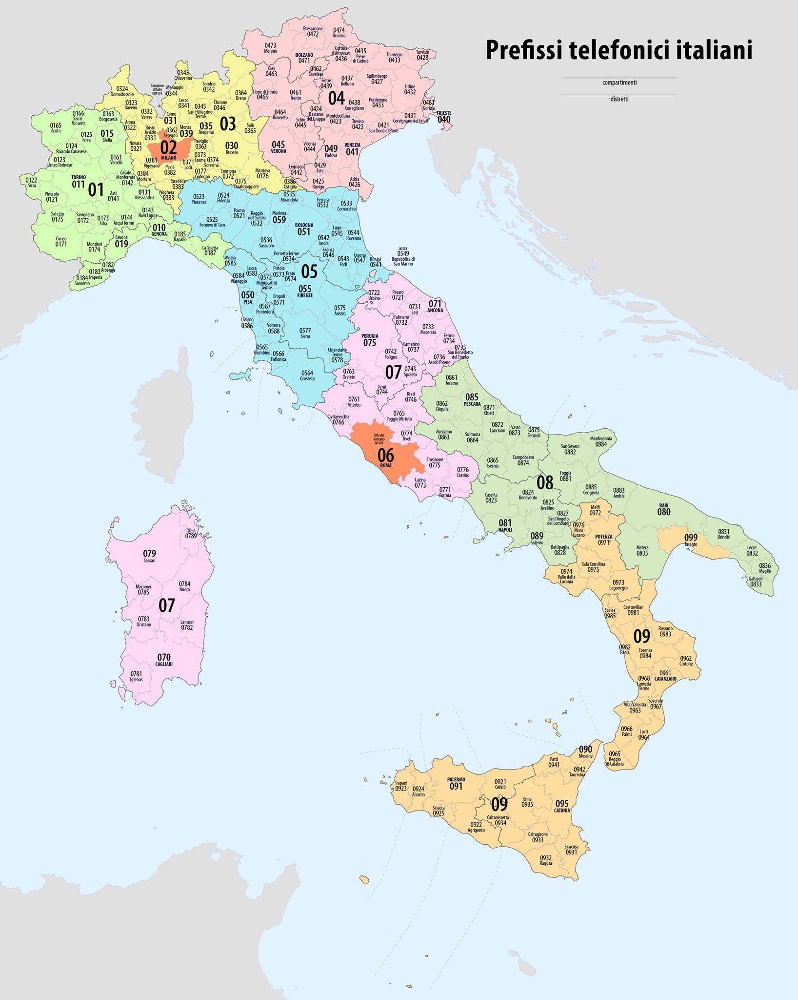

# Machines identification numbers 

*"All roads lead to Rome"*, a medieval **proverb** [[1]](https://en.wikipedia.org/wiki/Proverb). 

*This is only my two cents, don't go crazy dear fellows.* 

The telephonic prefix of Rome's province is 6. In the *world backwards*, that is how they explain meanings in subliminal voice service in the remote neural monitoring network, 6 is 9. In binary 6 is 00000110 and in the *world backwards* that is in my opinion the logical operator "not" is 11111001 that in decimal is 249 and in hexadecimal is F9. 

Speaking about the telephone prefix, 9 is south Italy, **Sicily** [[2]](https://en.wikipedia.org/wiki/Sicily), **Calabria** [[3]](https://en.wikipedia.org/wiki/Calabria), some province of **Campagna** [[4]](https://en.wikipedia.org/wiki/Campagna) and a province of **Puglia** [[5]](https://en.wikipedia.org/wiki/Apulia). Color is hexadecimal is #fdde9d and in **common name** [[6]](http://chir.ag/projects/name-that-color) is **Cherokee** [[7]](https://en.wikipedia.org/wiki/Cherokee).

As you can see telephone prefix 6 is the province of Rome. Vatican city add after the 06 code another three digit, 698. 

Another good correspondence could be the **ISO 3166** [[8]](https://en.wikipedia.org/wiki/ISO_3166) followed by **ISO 3166-2** [[9]](https://en.wikipedia.org/wiki/ISO_3166-2) and the consequent **ISO 3166-2:IT** [[10]](https://en.wikipedia.org/wiki/ISO_3166-2:IT), those are the codes of interest speaking about the number 9:

- IT-72 Campania, 01001000, 10110111, 183
- IT-78 Calabria
- IT-75 Puglia
- IT-82 Sicilia

Remember a think, in the world backwards or better saying the remote neural control network what address humans, but also system it's possible with a correct access point connected to them with a bridge, are unique electromagnetic identification. It's possible that those decimal numbers obtained by the not logic operation are possibly paid with this reasoning. 

Now another brainstorm have conducted me to think that the number 9 it's only to confuse me and put me in a theme of Mafia threats. 

I was born in Genova, prefix code 010, area code 01, color green reef #daffb4. And I've got parent from area code **1, 4, 7, 5**. Here is a little family tree:

https://www.myheritage.es/member-998780751_1/riccardo-beniamino-giuntoli?public=1

But I've got also parents from New York, Florida and Ireland. 

I'm not a noble and i'm not a masonic nor I've got some Lions or Rotary affiliations.

> *Now those machines are connected to the remote neural control network, but could also be connected by Internet or by a private metropolitan area network or could be connected by analogical telephone cable and could be reached by a remote PPP call with a modem. And many others technologies.* 

### External links

1. https://en.wikipedia.org/wiki/Proverb
2. https://en.wikipedia.org/wiki/Sicily
3. https://en.wikipedia.org/wiki/Calabria
4. https://en.wikipedia.org/wiki/Campagna
5. https://en.wikipedia.org/wiki/Apulia
6. http://chir.ag/projects/name-that-color
7. https://en.wikipedia.org/wiki/Cherokee
8. https://en.wikipedia.org/wiki/ISO_3166
9. https://en.wikipedia.org/wiki/ISO_3166-2
10. https://en.wikipedia.org/wiki/ISO_3166-2:IT

